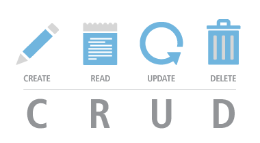

# Python-Crud-Application



This application is developed to demonstrate CRUD functionality with Python and MySQL database.
Application can easily be modified to work with MSSQL, Sqlite or any other type of database. 
In this case, I am using Azure MySQL database without SSL. Database credentials are stored in "parameters.config.json"

#### Installation
After cloning this repository, run SetUp.py which will install all required libraries. 
You might have to set up the interpreter as well. 

#### Usage
1. Run GUI.py
2. To create record, enter values for Temperature and Pressure and press enter.
3. To Read the data from database press Read Data which will pull data into grid
4. To Update data, select record and update the value
5. To Delete the record, select record and delete the value

#### Application modules
+ Dataimport - module which provides all necesery 


#### Logs


#### How it works
C -  Create Record
Once launched, application will prompt for two data points to be entered in Graphic User Interface. Once Temperature and pressure entered, 
User will be able to submit entered values which will trigger connection to database and data import. 

R -  Read Recrod

U - Update

#### Project Folder Structure

```
Python-Crud-Application
├── .git
│   ├── config
│   ├── description
│   ├── HEAD
│   ├── hooks
│   ├── index
│   ├── info
│   ├── logs
│   ├── objects
│   ├── packed-refs
│   └── refs
├── .gitignore
├── .idea
│   ├── .gitignore
│   ├── DataEntryApp.iml
│   ├── inspectionProfiles
│   ├── misc.xml
│   ├── modules.xml
│   ├── Python-Crud-Application.iml
│   ├── vcs.xml
│   └── workspace.xml
├── data
│   ├── CRUD-1.png
│   ├── CRUD.jpeg
│   ├── CRUD.png
│   └── Sample.csv
├── GUI.py
├── lib
│   ├── DataImport.py
│   ├── Tools.py
│   └── __pycache__
├── LICENSE
├── main.py
├── notebooks
│   └── Dev.ipynb
├── parameters
│   └── config.json
├── README.md
└── venv
    ├── .gitignore
    ├── etc
    ├── include
    ├── Lib
    ├── pyvenv.cfg
    ├── Scripts
    └── share
```

#### Contribution 
+ Larry Hack

#### MIT License:

Copyright (c) 2022 Slavoljub Petkovic

Permission is hereby granted, free of charge, to any person obtaining a copy
of this software and associated documentation files (the "Software"), to deal
in the Software without restriction, including without limitation the rights
to use, copy, modify, merge, publish, distribute, sublicense, and/or sell
copies of the Software, and to permit persons to whom the Software is
furnished to do so, subject to the following conditions:

The above copyright notice and this permission notice shall be included in all
copies or substantial portions of the Software.

THE SOFTWARE IS PROVIDED "AS IS", WITHOUT WARRANTY OF ANY KIND, EXPRESS OR
IMPLIED, INCLUDING BUT NOT LIMITED TO THE WARRANTIES OF MERCHANTABILITY,
FITNESS FOR A PARTICULAR PURPOSE AND NONINFRINGEMENT. IN NO EVENT SHALL THE
AUTHORS OR COPYRIGHT HOLDERS BE LIABLE FOR ANY CLAIM, DAMAGES OR OTHER
LIABILITY, WHETHER IN AN ACTION OF CONTRACT, TORT OR OTHERWISE, ARISING FROM,
OUT OF OR IN CONNECTION WITH THE SOFTWARE OR THE USE OR OTHER DEALINGS IN THE
SOFTWARE.


